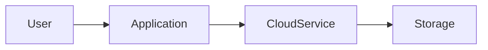

# Cloud Engineer Roadmap

This roadmap helps me build practical skills for a Cloud Engineering career. Each project produces useful evidence for a portfolio.

> **Safety:** Use free-tier resources where possible. Never commit credentials. Delete cloud resources after testing.

## 1. Dockerised Python API

**Level:** Beginner

### Goal
Build a small Python REST API, package it in Docker, and run it locally with a health check.

### Tools
Python, Flask or FastAPI, Docker, Linux, Git, GitHub Actions.

### Steps
1. Create a `/health` endpoint and one useful API endpoint.
2. Add input validation, error responses, and tests.
3. Write a `Dockerfile` and `.dockerignore`.
4. Build and run the image locally.
5. Add GitHub Actions to run tests.
6. Document setup, testing, and security notes.

### README evidence
Show the goal, API endpoints, architecture diagram, project structure, commands, test output, Docker health check, security notes, lessons learned, and improvements.

**Why:** It gives you a small application that can later be deployed to a cloud platform, Kubernetes, or a CI/CD pipeline.

## 2. Static Website with Cloud Storage and CDN

**Level:** Beginner

### Goal
Deploy a static website using cloud object storage and, where available, a CDN or static web hosting service.

### Tools
AWS S3 and CloudFront, or Azure Storage and Azure CDN, HTML, CSS, and GitHub.

### Steps
1. Create a small personal or project website.
2. Store the files in cloud storage.
3. Configure static hosting or a CDN.
4. Configure access carefully and avoid exposing unrelated storage.
5. Add HTTPS and a custom domain only when you understand the cost.
6. Test with a browser and `curl`.
7. Remove resources when finished.

### README evidence
Show the live link, architecture diagram, deployment steps, HTTPS and access configuration, screenshot, cost notes, cleanup instructions, and lessons learned.

**Why:** It teaches storage, delivery, access control, DNS, HTTPS, and cloud cost awareness.

## 3. Terraform Cloud Infrastructure

**Level:** Beginner to Intermediate

### Goal
Create repeatable cloud infrastructure with Terraform instead of configuring resources manually.

### Tools
Terraform, AWS or Azure, IAM, networking, Git, and Terraform validation commands.

### Steps
1. Choose a small, low-cost environment.
2. Configure the provider and variables.
3. Define outputs and resource tags.
4. Create a basic network and one safe service.
5. Run `terraform fmt`, `terraform validate`, and `terraform plan`.
6. Apply the plan and verify the resources.
7. Run `terraform destroy` when the lab is complete.
8. Never commit state files or secret values.

### README evidence
Show the infrastructure goal, architecture diagram, directory structure, plan summary without secrets, variables, outputs, validation commands, state handling, and cleanup commands.

**Why:** Infrastructure as Code demonstrates repeatability, reviewable changes, and safer infrastructure management.

## 4. Container Application on Kubernetes

**Level:** Intermediate

### Goal
Deploy a Dockerised API to a local Kubernetes cluster, then optionally to a managed cluster.

### Tools
Docker, Kubernetes, `kubectl`, Minikube or Kind, YAML, and Linux.

### Steps
1. Use the API from Project 1.
2. Build and test the Docker image.
3. Create a Deployment and Service.
4. Add resource requests, limits, and health probes.
5. Use a ConfigMap for non-secret configuration.
6. Test scaling and rolling updates locally.
7. Inspect logs and troubleshoot a broken deployment.

### README evidence
Show the architecture, manifest overview, deployment commands, service access, health-check and scaling evidence, logs, security notes, and cleanup commands.

**Why:** It builds on Docker and teaches deployments, services, health checks, scaling, and troubleshooting.

## 5. Cloud CI/CD and Monitoring Platform

**Level:** Intermediate

### Goal
Create a pipeline that tests code, builds a Docker image, deploys an application, and records basic logs or health information.

### Tools
GitHub Actions, Docker, Python, AWS or Azure, and cloud logging and monitoring services.

### Steps
1. Add tests and a health endpoint.
2. Create a workflow for pull requests and pushes.
3. Run formatting, tests, and security checks.
4. Build and tag a Docker image.
5. Store deployment credentials as GitHub secrets or use identity-based access.
6. Deploy to a test environment.
7. Add health checks and basic logs.
8. Document rollback steps.

### README evidence
Show the CI/CD diagram, workflow badge, test and build results, deployment environment, monitoring evidence, secret handling, and rollback process.

**Why:** Cloud engineers operate systems after deployment. CI/CD, observability, and rollback knowledge show practical operations skills.

# Reusable Cloud Project README Template

```markdown
# Project Name

Short description of what this project does.

## 📌 Overview

Explain the problem and solution in simple English.

## 🎯 Goal

What did you want to learn or build?

## 🏗️ Architecture



Explain the components and data flow below the diagram.

## 🧰 Technologies

| Technology | Purpose |
|---|---|
| Python | Application logic |
| Docker | Container packaging |
| Cloud service | Deployment or storage |

## 📁 Project Structure

```text
project-name/
├── src/
├── tests/
├── Dockerfile
├── README.md
└── .gitignore
```

## 🚀 Setup

```bash
git clone <repository-url>
cd <project-directory>
```

## ▶️ Run Locally

```bash
<commands>
```

## ☁️ Deployment

Explain where and how the project was deployed.

## ✅ Testing

Explain the tests and include important results.

## 🔐 Security Notes

- Never commit passwords, API keys, or private credentials.
- Use environment variables or a secret manager.
- Follow least-privilege access.
- Delete unused cloud resources.

## 📸 Evidence

Add screenshots, terminal output, deployment URLs, or monitoring graphs.

## 📚 What I Learned

- Lesson 1
- Lesson 2
- Lesson 3

## 🔄 Possible Improvements

- Improvement 1
- Improvement 2

## 🧹 Cleanup

Explain how to remove cloud resources and avoid unnecessary charges.
```

# 30-Day Plan

| Day | Small task | Result |
|---:|---|---|
| 1 | Write your Cloud Engineer goal and current skills | Learning baseline |
| 2 | Practise Linux files, directories, and permissions | Command notes |
| 3 | Practise Linux processes and services | Process exercise |
| 4 | Use Git branches, commits, and merges | Practice repository |
| 5 | Review cloud regions, availability zones, and shared responsibility | Cloud notes |
| 6 | Create a Python API with a health endpoint | Local API |
| 7 | Add input validation and error handling | Safer API |
| 8 | Add two or three tests | Test results |
| 9 | Write a Dockerfile | Reproducible image |
| 10 | Run and test the API with Docker | Working container |
| 11 | Create a small static website | Website files |
| 12 | Upload it to cloud storage or an emulator | Storage exercise |
| 13 | Learn IAM and least privilege | IAM notes |
| 14 | Learn DNS, HTTPS, and CDN basics | Request-flow diagram |
| 15 | Document the static website project | README draft |
| 16 | Install Terraform | Working setup |
| 17 | Create Terraform provider and variables | Configuration file |
| 18 | Add tags, outputs, and formatting | Maintainable code |
| 19 | Run `terraform validate` and `terraform plan` | Reviewed plan |
| 20 | Apply a small lab, then destroy it | IaC lifecycle |
| 21 | Install Minikube or Kind and `kubectl` | Local cluster |
| 22 | Create a Kubernetes Deployment | Running Pod |
| 23 | Create a Kubernetes Service | Application access |
| 24 | Add configuration and a health probe | Reliable deployment |
| 25 | Scale the Deployment and inspect logs | Operations practice |
| 26 | Create a GitHub Actions test workflow | Automated tests |
| 27 | Add Docker image build automation | Repeatable builds |
| 28 | Add a deployment or simulated deployment step | Pipeline draft |
| 29 | Add logging, monitoring, and rollback notes | Operations documentation |
| 30 | Update your profile README and choose your best projects | Stronger portfolio |

## Portfolio Rules

- Show evidence, not only technology names.
- Explain trade-offs and limitations.
- Include cleanup instructions.
- Keep credentials out of Git history.
- Use status labels honestly: Planned, In Progress, or Completed.
- Update the profile README when a project is genuinely complete.
